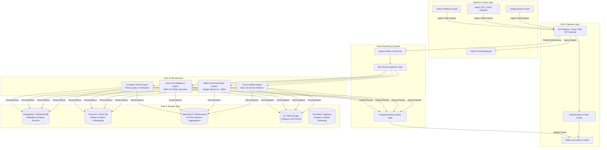

# System Architecture: Myntra AI Review Analytics & Intelligence Engine

> **Document Version:** 1.1.0  
> **Target Audience:** System Architects, AI/ML Engineers, Backend Engineers, Product Managers  

---

## 1. High-Level Architecture Overview

The **Myntra AI Review Intelligence Engine** is a high-throughput, low-latency distributed system designed to process existing user-generated reviews (text, images, ratings, and fit feedback) available across public feeds and catalog datasets. It enforces review authenticity, distills aspect-based customer sentiment, extracts body-metric intelligence, and powers real-time UI components across Myntra's mobile and web platforms.

---

## 2. Ingestion & Preprocessing Pipeline

### 2.1 Event-Driven Processing Workflow
1. **Feed Ingestion:** Existing review datasets (Star Rating, Review Text, Size Worn, Height/Weight metrics, Garment Photos) are ingested via batch endpoints or Kafka streams.
2. **Gateway Validation:** The API Gateway validates JWT tokens, rate limits batch jobs, and sanitizes input text.
3. **Kafka Ingestion:** The submission event is pushed to `kafka.reviews.raw` with partition key `sku_id` to guarantee ordering per product.
4. **Preprocessing Worker:**
   - **PII Scrubbing:** Redacts phone numbers, emails, or personal handles using Regex and SpaCy entity masking.
   - **Language Identification:** Detects language (English, Hindi, Hinglish) and routes to appropriate NLP tokenization pipelines.

---

## 3. Core AI Microservices Deep-Dive

### 3.1 Trust & Safety Engine (Synthetic & Fake Review Detector)
* **Text Feature Extractor:** Analyzes perplexity, burstiness, and repetitive phrase n-grams to detect synthetic LLM reviews in existing datasets.
* **Rating-Text Sentiment Variance:** Flags reviews where numerical rating (e.g., `5 Stars`) strongly diverges from text sentiment.

### 3.2 Aspect-Based Sentiment Analysis (ABSA) & Gemini Summarization
* **Aspect Extractor (Fine-Tuned Transformer / Lexicon Engine):** Identifies domain categories: `Fabric Quality`, `Color Accuracy`, `Stitching/Durability`, `Transparency`, `Shrinkage`.
* **Google Gemini AI Integration (`gemini-2.5-flash`):** Synthesize aspect clusters into structured pros, cons, and 1-sentence SKU insight cards.

### 3.3 Size & Fit Intelligence Engine
* **Body Metric NER (Named Entity Recognition):** Extracts body metrics from existing review text (e.g., *"5'9 ft"*, *"70 kg"*, *"175cm"*).
* **Fit Delta Classifier:** Categorizes fit feedback into discrete buckets: `Runs Small (-1)`, `True to Size (0)`, `Runs Large (+1)`.

---

## 4. Data Storage & Indexing Architecture

| Storage Layer | Engine | Use Case |
| :--- | :--- | :--- |
| **Relational Store** | SQLite / PostgreSQL | Source of truth for review metadata and SKU summary records |
| **Vector Database** | Pinecone / Qdrant | Dense vector embeddings for semantic review search |
| **Search Engine** | OpenSearch / Elasticsearch | Inverted index document store for faceted height/weight review search |
| **Caching Layer** | Redis Cluster | Sub-50ms query caching for pre-aggregated SKU AI summary cards |
