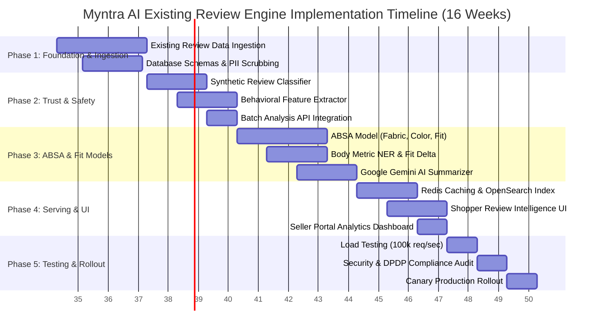

# Implementation Plan: Myntra AI Review Analytics & Intelligence Engine

> **Project Roadmap:** 16-Week Phase-Wise Execution Plan (Pure Existing Review Analysis Scope)  
> **Document Version:** 1.1.0  
> **Target Audience:** Engineering Leads, Product Managers, ML Engineers, DevOps & QA Teams  

---

## 1. Executive Summary & Phased Roadmap

This document outlines the step-by-step technical implementation roadmap for deploying the **Myntra AI Existing Review Intelligence & Governance Engine**. The system focuses exclusively on **ingesting, parsing, analyzing, and synthesizing existing reviews and public product feedback feeds**, converting raw unstructured review text into actionable size/fit curves, aspect summaries, and seller quality defect alerts.

---

## 2. Detailed Phase Breakdowns

### Phase 1: Foundation & Existing Review Data Pipeline (Weeks 1 – 3)
**Primary Goal:** Build scalable ingestion pipelines and database schemas to import and process existing review feeds safely.

* **Key Deliverables:**
  1. **Batch Ingestion Endpoints:** Configure `POST /v1/reviews/bulk-analyze` and `POST /v1/reviews` to ingest external review datasets (CSV, JSON feeds, catalog reviews).
  2. **Streaming Event Bus:** Deploy Apache Kafka topic `kafka.reviews.raw` partitioned by `sku_id`.
  3. **Relational Database Deployment:** Set up SQLite/PostgreSQL tables (`reviews`, `review_aspects`, `moderation_queue`, `sku_fit_summaries`).
  4. **PII Masking Worker:** Implement regex and SpaCy NLP worker to redact phone numbers, emails, social handles, and links from existing review text.

* **Definition of Done (DoD):**
  - Existing review datasets ingested into Kafka with `< 10ms` gateway latency.
  - PII scrubbing achieving 100% redaction on benchmark test sets.

---

### Phase 2: Trust & Safety Engine — Synthetic Review Detection (Weeks 4 – 6)
**Primary Goal:** Detect and filter AI-generated synthetic text, bot spam, and incentivized fake reviews within existing review datasets.

* **Key Deliverables:**
  1. **Synthetic Text Detector:** Train fine-tuned classifier (DeBERTa-v3) analyzing text perplexity, token entropy, and n-gram repetition.
  2. **Behavioral Feature Pipeline:** Build real-time feature aggregators tracking reviewer account age, IP velocity, and verified purchase flags.
  3. **Rating-Sentiment Discrepancy Checker:** Implement rule engine flagging reviews where text sentiment contradicts star ratings.
  4. **Batch Analysis API Integration:** Expose synthetic AI score scanner endpoint for arbitrary review text feeds.

* **Definition of Done (DoD):**
  - Fake review detection achieving **> 95% precision** on evaluation dataset.

---

### Phase 3: ABSA, Fit Intelligence & Gemini AI Summarization (Weeks 7 – 10)
**Primary Goal:** Extract fashion-specific aspect sentiments, body metric entities, and generate Gemini AI summaries from existing review text.

* **Key Deliverables:**
  1. **ABSA Model:** Train multi-label classification model for fashion aspects (*Fabric Quality, Color Accuracy, Stitching, Transparency, Shrinkage*).
  2. **Body Metric NER Engine:** Deploy SpaCy/Transformer model extracting user metrics (*"5'8 ft"*, *"70kg"*, *"Broad shoulders"*, *"175cm"*).
  3. **Fit Delta Classifier:** Algorithm categorizing reviews into `Runs Small (-1)`, `True to Size (0)`, and `Runs Large (+1)`.
  4. **Google Gemini AI Integration (`gemini-2.5-flash`):** Synthesize aspect clusters into structured pros, cons, and 1-sentence SKU insight cards.
  5. **Computer Vision Filter:** OpenCV filter detecting blurry customer photos and format validity.

* **Definition of Done (DoD):**
  - ABSA model achieving **> 90% F1-score** across top 5 fashion aspects.
  - Gemini AI generating structured pros/cons cards under 2 seconds.

---

### Phase 4: Low-Latency Serving, Caching & Analytics UI (Weeks 11 – 13)
**Primary Goal:** Serve aggregated existing review intelligence to shoppers under 50ms and expose brand defect analytics to sellers.

* **Key Deliverables:**
  1. **Redis Caching Layer:** Build Redis cluster caching SKU summary cards (`sku:insight_summary:{sku_id}`) with 1-hour TTL and event-driven invalidation.
  2. **OpenSearch Indexing:** Index reviews in OpenSearch for real-time facet filtering by height, weight, build, and aspect keywords.
  3. **Shopper Review Analytics UI (`static/index.html`):**
     - *Smart AI Review Summary Card* (Pros & Cons bullets).
     - *Interactive Fit Bar* (% True to Size / Small / Large).
     - *Faceted Review Search by Height / Build / Size Worn*.
     - *Batch Review Dataset Analyzer Tool*.
  4. **Seller Portal Quality Dashboard:** Expose product aspect defect trends and sizing calibration recommendations to brand partners.

* **Definition of Done (DoD):**
  - P99 latency on SKU insights query `< 45ms` under benchmark load via Redis Cache.

---

### Phase 5: Load Testing, Compliance & Staged Rollout (Weeks 14 – 16)
**Primary Goal:** Stress-test system at peak sale volumes, audit security/compliance, and execute production deployment.

* **Key Deliverables:**
  1. **Stress & Load Testing:** Locust / K6 load testing simulating **100,000 requests/sec**.
  2. **Security & DPDP Audit:** Data privacy compliance verification (anonymization of body metrics, encryption at rest/in transit).
  3. **Phased Production Deployment:** Rollout across all catalog product categories.
  4. **MLOps Monitoring Setup:** Deploy Evidently AI for model drift tracking and Grafana alert dashboards.

---

## 3. Risk Management & Mitigation Matrix

| Identified Risk | Severity | Impact Area | Mitigation Strategy |
| :--- | :---: | :--- | :--- |
| **High LLM Summarizer Latency** | High | User Experience | Pre-compute & cache summaries in Redis; fall back to local cluster engine if API times out |
| **Model Performance Drift (New Slang)** | Medium | System Accuracy | Set up weekly drift detection via Evidently AI; trigger automated re-training pipelines |
| **Kafka Pipeline Backlog during Heavy Ingestion** | High | System Processing | Configure Horizontal Pod Autoscaling (HPA) triggered by Kafka consumer lag metrics |
| **User Privacy Concerns (Body Data)** | High | Compliance | Anonymize and decouple body metrics (Height/Weight) from account PII in database storage |
